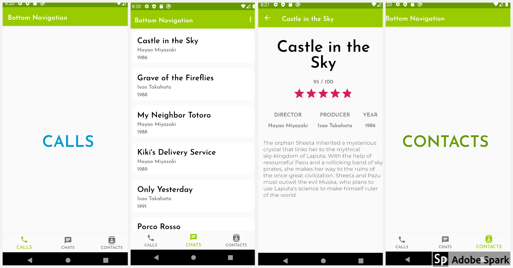

### 프로그라피 사전 과제 (Android)

#### MVVM, ViewModel, LiveData 
* MVVM 아키텍처를 기반으로 설계하였습니다. 
* Retrofit, Gson 을 이용해 JSON 객체를 읽어와 `Film` data class 객체로 변환하였습니다.
* MVVM 아키텍처에서 흔히 사용되는 Repository 레이어를 만들지 않은 이유는 Data source 가 하나 뿐이며, 
받아온 정보를 처리하는 데 있어서 복잡한 비즈니스 로직이 없다고 판단했기 때문입니다.   
* 데이터를 ViewModel과 LiveData를 이용해 관리합니다.

#### ViewPager & FragmentStatePagerAdapter
* 뷰 페이저와 하단의 Bottom Navigation View 가 서로 일치하며 변화할 수 있도록 
하단의 버튼 상태에 따라 뷰 페이저가 올바른 위치로 이동하게끔 만들었습니다. 
* 마찬가지로 뷰 페이저를 슬라이드 하면 그에 맞게 버튼 상태가 바뀌도록 하였습니다. 

#### RecyclerView & ListAdapter
* RecyclerView 에서 ListAdapter 와 DiffUtilCallback 을 사용해 리스트를 효율적으로 업데이트 하고자 했습니다. (비록 static 한 API 정보 인 것 같았지만)
* RecyclerView 의 아이템을 클릭하면 DetailActivity 로 넘어가서 세부 정보를 표시하도록 했습니다.

#### etc. 
* DetailActivity 에서 정보의 양이 스크린의 범위를 초과할 경우 텍스트가 잘리지 않도록 상위 레이아웃을 ScrollView 로 설정했습니다.
* DetailActivity 에서 Home 으로 가는 Back 버튼을 ActionBar 에 추가하였습니다.
* Network 상태를 LOADING, DONE, ERROR 로 나누고 그에 따라 ProgressBar 상태를 변경하도록 하였습니다. 
* SwipeRefreshLayout 으로 RecyclerView 를 감싸도록 하여 아래로 내리면 네트워크 요청을 다시 할 수 있도록 하였습니다.  

### Demonstration 
* Emulation 환경 : Samsung Galaxy S10 (API 28), Pixel 3A (API 29)

#### Bottom Navigation

#### Main - Detail Flow

#### Network Checking 

 